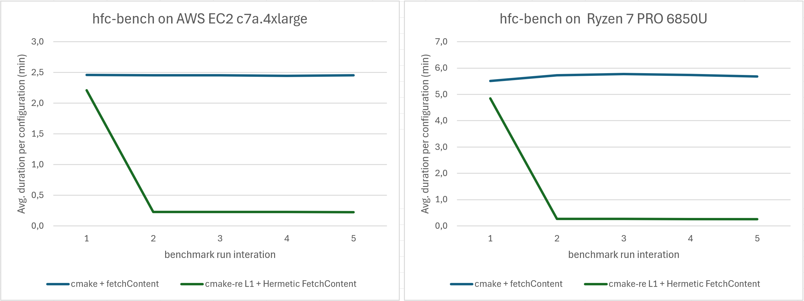

HFC Benchmark project
=====================

Reference benchmark project for [Hermetic FetchContent](https://github.com/tipi-build/hfc). Compiles a really simple project that depends on the Boost library and does simulate repeated clean builds against 2 build configurations (`Debug` and `Release` builds) while switching the Boost version in between builds (e.g. simulates upgrading from Boost v1.84 to v1.85).

A log file containing the per run statistics is created in the `bench_log_<timestamp>.txt` file. Each of the tree scenarios (`cmake + fetchContent`, `cmake + Hermetic FetchContent` and `cmake-re + Hermetic FetchContent`) of this comparative benchmark gets its own section of five consecutive runs of the process described (`Debug build Boost 1.84` -> `Release build Boost 1.84` -> `Debug build Boost 1.85` -> `Release build Boost 1.85`). The build folders are being wiped out between reconfiguration.

To ensure fair comparison cmake-re's shared cache for this project is invalidated and wiped before the benchmark run in order to ensure that the Boost dependency has to be built (no initial cache benchmarking vs. hot cache which would be much quicker, yielding a first run that would roughly be as fast any of the subsequent runs).

Results
-------



As can be seen, the build times are reduced by a factor of 10 to 21 once the caches (source cache for `cmake + Hermetic FetchContent` and the shared cmake-re L1 cache in the case of `cmake-re + Hermetic FetchContent`) are enabled.

At the core these improvements can be achieved by evolving the following "only CMake FetchContent" `CMakeLists.txt` 

```cmake
FetchContent_Declare(
  Boost
  GIT_REPOSITORY https://github.com/boostorg/boost
  GIT_TAG        "ad09f667e61e18f5c31590941e748ac38e5a81bf" # boost 1.85
)

set(BOOST_BUILD_TEST OFF CACHE BOOL "" FORCE)
set(BOOST_ENABLE_PYTHON OFF CACHE BOOL "" FORCE)
FetchContent_MakeAvailable(Boost)
```

to the [Hermetic FetchContent](https://github.com/tipi-build/hfc) enabled build which enables source caching at the project level:

```cmake
FetchContent_Declare(
  Boost
  GIT_REPOSITORY https://github.com/boostorg/boost
  GIT_TAG        "ad09f667e61e18f5c31590941e748ac38e5a81bf" # boost 1.85
)

FetchContent_MakeHermetic(
  Boost
  HERMETIC_TOOLCHAIN_EXTENSION
  [=[
    set(BOOST_BUILD_TEST OFF CACHE BOOL "" FORCE)
    set(BOOST_ENABLE_PYTHON OFF CACHE BOOL "" FORCE)
  ]=]
)

HermeticFetchContent_MakeAvailableAtBuildTime(Boost)
```


Result Details
--------------

### On AWS EC2 c7a.4xlarge

This reference provided results have been produced by running the benchmark as described in this document on an `AWS EC2 c7a.4xlarge` instance hosted in `eu-central-1` (16 core AMD EPYC 9R14, 32 GiB, provisioned IO2 EBS volume with 100000 IOPS).

|                   | `cmake + fetchContent` "ref"  | % of run 1  | `cmake + Hermetic FetchContent` | % of run 1  | % **ref** run | `cmake-re + Hermetic FetchContent`  | % of run 1  | % **ref** run |
|-------------------|-------------------------------|-------------|---------------------------------|-------------|---------------|-------------------------------------|-------------|---------------|
| Run 1             | 590546ms                      | n/a         | 369024ms                        | n/a         | 62.49%        | 530265ms                            | n/a         | 89.79%        |
| Run 2             | 588662ms                      | 99.68%      | 114364ms                        | 30.99%      | 19.43%        | 55070ms                             | 10.39%      |  9.36%        |
| Run 3             | 589397ms                      | 99.81%      | 114353ms                        | 30.99%      | 19.40%        | 55355ms                             | 10.44%      |  9.39%        |
| Run 4             | 587088ms                      | 99.41%      | 114514ms                        | 31.03%      | 19.51%        | 55205ms                             | 10.41%      |  9.40%        |
| Run 5             | 589304ms                      | 99.79%      | 114773ms                        | 31.10%      | 19.48%        | 54437ms                             | 10.27%      |  9.24%        |
| Average (s)       | 589.0s                        | n/a         | 165.4s                          | n/a         | 28.08%        | 150.1s	                            | n/a         | 25.48%        |
| Average (min)     | 9min 48.9s                    | n/a         | 2min 45s                        | n/a         | 28.08%        | 2min 30s                            | n/a         | 25.48%        |
| Per config* (s)   | 147.2s                        | n/a         | 41.4s                           | n/a         | 28.08%        | 37.5s                               | n/a         | 25.48%        |
| Per config* (min) | 2min 27.2s                    | n/a         | 0min 41.4s                      | n/a         | 28.08%        | 0min 37.5s                          | n/a         | 25.48%        |

### On developer laptop / Ryzen 7 PRO 6850U

This reference provided results have been produced by running the benchmark as described in this document on an `Lenovo Z13` laptop (8 core AMD Ryzen 7 PRO 6850U, 16 GiB, with an SSD drive and Docker running in WSL2).

|                   | `cmake + fetchContent` "ref"  | % of run 1  | `cmake + Hermetic FetchContent` | % of run 1  | % **ref** run | `cmake-re + Hermetic FetchContent`  | % of run 1  | % **ref** run |
|-------------------|-------------------------------|-------------|---------------------------------|-------------|---------------|-------------------------------------|-------------|---------------|
| Run 1             | 1323602ms                     | n/a         | 884640ms                        | n/a         | 66.84%        | 1163952ms                           | n/a         | 87.94%        |
| Run 2             | 1374754ms                     | 103.86%     | 404862ms                        | 45.77%      | 29.45%        | 63803ms                             | 5.48%       |  4.64%        |
| Run 3             | 1384992ms                     | 104.64%     | 410049ms                        | 46.35%      | 29.61%        | 66127ms                             | 5.68%       |  4.77%        |
| Run 4             | 1377534ms                     | 104.07%     | 404017ms                        | 45.67%      | 29.33%        | 62038ms                             | 5.33%       |  4.50%        |
| Run 5             | 1364350ms                     | 103.08%     | 401778ms                        | 45.42%      | 29.45%        | 62112ms                             | 5.34%       |  4.55%        |
| Average (s)       | 1365.1s                       | n/a         | 501.1s                          | n/a         | 36.71%        | 283.6s                              | n/a         | 20.78%        |
| Average (min)     | 22min 45.0s                   | n/a         | 8min 21.1s                      | n/a         | 36.71%        | 4min 43.6s                          | n/a         | 20.78%        |
| Per config* (s)   | 341.3s                        | n/a         | 125.3s                          | n/a         | 36.71%        | 70.9s                               | n/a         | 20.78%        |
| Per config* (min) | 5min 41.3s                    | n/a         | 2min 5.3s                       | n/a         | 36.71%        | 1min 10.9s                          | n/a         | 20.78%        |

>
> (*) each run builds 4 configurations, row values are thus the `<average value> / 4`
>
> Benchmark logs from which this data was extracted can be found in [benchmark_results](./benchmark_results/)
>

To run this benchmark:
----------------------

1. Make sure you are connected to your tipi account (run `tipi connect`)
2. Set the environment variable `TIPI_VAULT_PASSPHRASE` to contain your tipi vault passphrase - it will be forwarded to the container to enable L1 cache storage
3. Run the following commands:

```bash
docker pull tipibuild/tipi-ubuntu:latest
rm -rf build/
docker run --rm -u`id -u`:`id -g` -v $PWD:$PWD -w $PWD \
  -e TIPI_ACCESS_TOKEN=`cat /usr/local/share/.tipi/.access_token` \
  -e TIPI_REFRESH_TOKEN=`cat /usr/local/share/.tipi/.refresh_token` \
  -e TIPI_VAULT_PASSPHRASE \
  tipibuild/tipi-ubuntu:latest $PWD/run_bench.sh
```

4. Wait and find the results in the `bench_log_<timestamp>.txt` log


